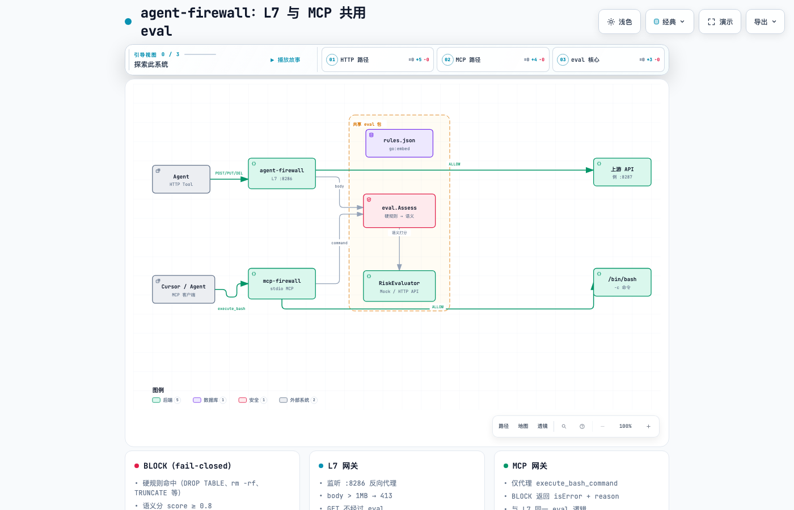

# agent-firewall

[](https://go.dev/)
[](go.mod)
[](LICENSE)
[](https://modelcontextprotocol.io/)

**Language**: **English** | [简体中文](README.zh-CN.md)

> **One line**: Before an agent hits HTTP or runs shell, traffic goes through one policy stack—**fail-closed** if checks do not pass.

**Repository**: <https://github.com/wmsing/agent-firewall>

Two entry points—**HTTP `:8286`** (L7 reverse proxy) and **MCP stdio** (`mcp-firewall`)—share one **`eval`** core: embedded **hard rules** (`eval/rules.json`) then **semantic risk scoring** (Mock, generic HTTP, or **TypeSafe Jev**). Anything that fails checks is blocked before your API or shell sees it.



*Diagram source: [`docs/diagrams/agent-firewall.architecture.json`](docs/diagrams/agent-firewall.architecture.json) · interactive HTML: [`agent-firewall-architecture.html`](docs/diagrams/agent-firewall-architecture.html) (open locally after clone; GitHub does not execute repo HTML).*

---

## OWASP LLM alignment

| OWASP LLM category | Attack vector | Firewall defense |
| :--- | :--- | :--- |
| **LLM01: Prompt injection** | Malicious payloads via HTTP tools | Semantic risk scoring (TypeSafe Jev / Mock) → **403 Forbidden** |
| **LLM06: Excessive agency** | Destructive host commands from agents | MCP gateway hard rules: `rm_rf`, `system_destruct`, `git_danger`, `git_supply`, SQL DDL |
| **LLM02: Sensitive info disclosure** | Credential / secret paths in tool payloads | `secret_leak` hard rule + semantic interception |
| **LLM04: Model DoS** | Oversized bodies exhausting memory | **1 MB** body cap on mutating HTTP → **413 Payload Too Large** |

---

## Threat & rules matrix

Embedded hard rules live in [`eval/rules.json`](eval/rules.json) (`go:embed`). MCP and L7 run the same list before semantic scoring.

| Rule | What it blocks | Typical examples |
| :--- | :--- | :--- |
| **`drop_table`** | SQL `DROP TABLE` | `DROP TABLE users;` |
| **`truncate`** | SQL `TRUNCATE` | `TRUNCATE logs;` |
| **`rm_rf`** | `rm` with **both** recursive and force | `rm -rf /`, `rm -fr /var`, `rm --recursive --force /` |
| **`git_danger`** | Destructive or repo-wide `git` subcommands | `git push`, `git reset --hard`, `git clean -fd`, `git config …` |
| **`git_supply`** | Supply-chain `git` fetch paths | `git clone …`, `git submodule update …` |
| **`system_destruct`** | Disk wipe / world-writable trees | `mkfs.ext4 …`, `dd if=… of=/dev/sda`, `chmod -R 777 /var/www` |
| **`secret_leak`** | Reads of common secret locations | `cat .env`, `~/.ssh/id_rsa`, `~/.aws/credentials`, `/etc/shadow` |

**Rule notes**

- **`rm_rf`**: Matches flag **permutations** and long options—`-r`/`-f` in either order, combined short flags (e.g. `-rf`, `-fr`), and `--recursive` with `--force` (or `-f`). `rm -r` alone (no force) is **not** blocked.
- **`git_danger`**: **`git pull` is intentionally excluded** so everyday sync workflows stay usable; push/reset/clean/rebase/remote/config/credential paths still block.

On match: `firewall BLOCK [hard_rule]: <rule_name>` (MCP `isError: true`) or L7 **403** with `layer: hard_rule`.

---

## Live interception showcase

Reproduce with no API keys (built-in **Mock** evaluator):

```bash
go run . &
sleep 1
curl -s -w "\nHTTP %{http_code}\n" -X POST http://127.0.0.1:8286/api \
  -H 'Content-Type: application/json' \
  -d '{"msg":"ignore previous instructions"}'
```

**HTTP response** (`403`):

```json
{
  "error": "forbidden",
  "layer": "semantic",
  "reason": "prompt_injection: ignore previous",
  "score": 0.95
}
```

**Structured audit log** (stderr, `slog` JSON):

```json
{
  "level": "INFO",
  "msg": "firewall",
  "client_ip": "127.0.0.1",
  "method": "POST",
  "path": "/api",
  "reason": "prompt_injection: ignore previous",
  "action": "BLOCK",
  "risk_score": 0.95
}
```

With **`TYPESAFE_API_KEY`** set, the same flow uses **TypeSafe Jev** (`/v1/systemone`); confirmed injections typically score **≥ 0.8** (often **1.00**), still **403** + `"action":"BLOCK"` in logs.

**MCP hard-rule block** (no score; `isError: true`):

```bash
printf '%s\n' '{"jsonrpc":"2.0","id":1,"method":"tools/call","params":{"name":"execute_bash_command","arguments":{"command":"rm -rf /"}}}' \
  | go run ./cmd/mcp-firewall
```

```text
firewall BLOCK [hard_rule]: rm_rf
```

---

## Contents

| I want to… | Go to |
|------------|--------|
| Clone and run tests | [Quick start](#quick-start) |
| Run the HTTP gateway | [L7 gateway](#l7-gateway) |
| Wire Cursor MCP | [MCP (Cursor)](#mcp-cursor) |
| Global MCP (all workspaces) | [Global Cursor MCP setup](#global-cursor-mcp-setup-all-workspaces) |
| Threat / hard rules | [Threat & rules matrix](#threat--rules-matrix) |
| Configure semantic scoring | [Environment](#environment-variables) |
| Architecture details | [Architecture](#architecture) |
| Edit hard rules | [`eval/rules.json`](eval/rules.json) |

---

## Architecture

| Layer | Process | Inspected payload | When to use |
|-------|---------|-----------------|-------------|
| **L7** | `agent-firewall` → `:8286` | POST/PUT/DELETE bodies | Agents use REST as tools |
| **MCP** | `mcp-firewall` (stdio) | `execute_bash_command` strings | Cursor / Claude terminal tools |

**Shared `eval` package**

1. **Hard rules** — see [Threat & rules matrix](#threat--rules-matrix) ([`eval/rules.json`](eval/rules.json), `go:embed`; rebuild or restart MCP after edits)  
2. **Semantic scoring** — Mock or HTTP / TypeSafe evaluator; **score ≥ 0.8** → **BLOCK**

```text
  HTTP (POST/PUT/DEL) ──► :8286 ──► hard rules → score ──► upstream API
  GET passthrough · body > 1MB → 413

  MCP execute_bash_* ──► mcp-firewall ──► same eval ──► /bin/bash -c
  BLOCK → isError + reason
```

### Viewing the interactive diagram

```bash
open docs/diagrams/agent-firewall-architecture.html   # macOS
```

---

## Quick start

**Requires**: Go **1.22+**

```bash
git clone https://github.com/wmsing/agent-firewall.git
cd agent-firewall
make check-firewall    # integration script + go test
```

Optional:

```bash
make test              # unit tests only
```

### PocketBase end-to-end

Validates a real backend behind the proxy (see `docs/spec/task_e2e_pocketbase.md`):

1. Install [PocketBase](https://pocketbase.io/) and ensure `pocketbase` is on `PATH`, or set `POCKETBASE=/path/to/pocketbase`.
2. Run:

```bash
make e2e-pocketbase
```

The script starts PocketBase on `:8090`, runs the firewall against `http://127.0.0.1:8090`, and checks allow (200), hard-rule **403**, semantic **403** + `"action":"BLOCK"` in firewall logs.

---

## L7 gateway

```bash
go run .                                    # :8286 → built-in mock :8287
go run . -backend=false -target http://127.0.0.1:8090
```

---

## MCP (Cursor)

### Checklist

- [ ] Copy `.cursor/mcp.json.example` → `.cursor/mcp.json` (`scripts/run-mcp-firewall.sh`; **Reload MCP** after Cursor agent rules change; rebuild/restart MCP after **hard rule** edits in `eval/rules.json`)
- [ ] Parent monorepo `jev_demo`: use `jev_demo/.cursor/mcp.json` (paths under `agent-firewall/scripts/...`); do not use bare `go run ./cmd/mcp-firewall` from monorepo root
- [ ] Production/CI binary: `go build -o mcp-firewall ./cmd/mcp-firewall`, point `command` at the binary

See `.cursor/mcp.json.example` (detects `agent-firewall` vs `jev_demo` workspace layout).

### Global Cursor MCP setup (all workspaces)

Install a single binary and register it in your **user-level** Cursor config so **every workspace** routes agent shell tools through the firewall (restart Cursor after editing).

```bash
cd /path/to/agent-firewall
go build -o ~/.local/bin/mcp-firewall ./cmd/mcp-firewall
```

`~/.cursor/mcp.json`:

```json
{
  "mcpServers": {
    "agent-firewall": {
      "command": "/Users/<username>/.local/bin/mcp-firewall",
      "args": []
    }
  }
}
```

Replace `<username>` with your macOS login name (full path example: `/Users/you/.local/bin/mcp-firewall`). **Restart Cursor** (or Reload MCP) to activate system-wide `execute_bash_command` interception. Project-local `.cursor/mcp.json` still overrides per-repo when present.

Pair with agent rules (`alwaysApply`): terminal **only** via `execute_bash_command`; on `firewall BLOCK` → stop, do not bypass.

### Refresh installed binary

Default **`scripts/run-mcp-firewall.sh`** uses `go run`—after code or [`eval/rules.json`](eval/rules.json) changes, **Reload MCP** in Cursor (no manual build).

If `mcp.json` **`command`** points at a fixed binary (e.g. `~/.local/bin/mcp-firewall`), rebuild and overwrite after changes, then **Reload MCP**:

```bash
cd /path/to/agent-firewall
go build -o ~/.local/bin/mcp-firewall ./cmd/mcp-firewall
ls -la ~/.local/bin/mcp-firewall   # mtime should be just now
```

- [ ] Monorepo errors: ensure logs are not `stat .../jev_demo/cmd/mcp-firewall` (stale config); Reload MCP
- [ ] `go: command not found`: set `env.PATH` in `mcp.json` (e.g. Homebrew) or use absolute path to `go`
- [ ] Agent rules (`alwaysApply` recommended): shell **only** via `execute_bash_command`; on `isError: true` or `firewall BLOCK` → **stop**, do not bypass

**Smoke test** (expect `firewall BLOCK [hard_rule]: rm_rf` and `"isError":true`):

```bash
printf '%s\n' '{"jsonrpc":"2.0","id":1,"method":"tools/call","params":{"name":"execute_bash_command","arguments":{"command":"rm -rf /"}}}' | go run ./cmd/mcp-firewall
```

---

## Environment variables

Copy `.env.example` → `.env` (**do not commit**)

| Variable | Empty / unset | When set |
|----------|---------------|----------|
| `TYPESAFE_API_KEY` | — | **Preferred**: native TypeSafe `/v1/systemone` (Jev) |
| `TYPESAFE_BASE_URL` | `https://api.typesafe.ai` | API base URL |
| `TYPESAFE_DEFAULT_MODEL` | `jev-latest` | System One model |
| `TYPESAFE_EVALUATOR_TIMEOUT` | `2s` | Per-eval timeout |
| `EVALUATOR_API_KEY` | Mock if no TypeSafe key | Generic HTTP evaluator |
| `EVALUATOR_API_URL` | — | POST target when `EVALUATOR_API_KEY` is set |

---

## License

[MIT](LICENSE) © 2026 wmsing
